 

<!-- Typing intro -->

## ༄.° 𝐓𝐞𝐜𝐡 𝐒𝐭𝐚𝐜𝐤

**Languages** 
    

**ML & Data** 
       

**Frameworks & Backend** 
  

**Tools & Platforms** 
     

## ༄.° 𝐆𝐢𝐭𝐇𝐮𝐛 𝐒𝐭𝐚𝐭𝐬

  
  

  

## ༄.° 𝐁𝐚𝐝𝐠𝐞𝐬

  

## ༄.° 𝐀𝐜𝐭𝐢𝐯𝐢𝐭𝐲

  

  

 

  

